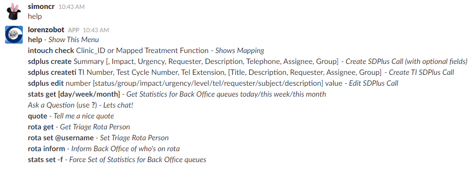
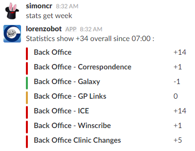
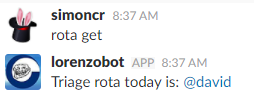
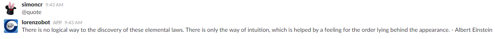

# Lorenzobot _(A custom bot for Slack)_
Made for North Bristol Trust Back Office Team.

## Background
Lorenzobot understands and reacts to commands given to it by chatting to the bot on Slack `(@lorenzobot)`. It also issues a daily rota for call triaging, monitors the triage queues on SDPlus, and also records daily stats about the amount of open calls in SDPlus.

### Commands are

`help` - Show This Menu  
`intouch check` - ClinicID or Mapped Treatment Function - Shows Mapping  
`sdplus create` - Summary [, Impact, Urgency, Requester, Description, Telephone, Assignee, Group] - Create SDPlus Call (with optional fields)  
`sdplus createti` -  TI Number, Test Cycle Number, Tel Extension, [Title, Description, Requester, Assignee, Group] - Create TI SDPlus Call  
`sdplus edit` - number [status/group/impact/urgency/level/tel/requester/subject/description] value - Edit SDPlus Call  
`stats get [day/week/month]` - Get Statistics for Back Office queues today/this week/this month  
Ask a Question (use `?`) - Lets chat!  
`quote` - Tell me a nice quote  
`rota get` - Get Triage Rota Person  
`rota set @username` - Set Triage Rota Person  
`rota inform` - Inform Back Office of who's on rota  
`stats set -f` - Force Set of Statistics for Back Office queues  

## Prerequisite
On the server PC, install "Visual C++ Redistributable for Visual Studio 2015 x86.exe" (on 32-bit, or x64 on 64-bit) which allows Python 3.5 dlls to work, found here:
https://www.microsoft.com/en-gb/download/details.aspx?id=48145

### Installation and Running
Make a folder in "C:\lorenzobot" (or another location of you choice) and put all the following files in there:
- Back Office queue count.csv
- Back Office queue list.txt
- slack_lorenzobot.exe
- slack_lorenzobot.log
- triage_rota.csv

Right click "C:\lorenzobot" (or equivalent), Security, Edit, Add, "Network Service" (user), Check Names, ok, tick "Full control", OK

Lorenzobot is installed as a Windows Service, as it needs access to slack.com, but no local network shares.

Use [nssm.exe](https://nssm.cc) to install a windows service.

On an administrator command line, type:
`C:\lorenzobot\nssm install LorenzoBot`

A dialogue box will appear. Use the following settings
- Application:
  - Path: `C:\lorenzobot\slack_lorenzobot.exe`
  - Log on:
    - This account: Network Service (NOTE: ensure you add permissions for user "Network Service" to read/write your .exe directory)
  - I/O:
    - Output (stdout): `C:\lorenzobot\slack_lorenzobot.log`

### Notes
Here is each file with a description:
- Back Office queue count.csv = records stats when someone types "stats set -f", else gets written to automatically everyday at 7am
- Back Office queue list.txt = holds the queue IDs to monitor
- slack_lorenzobot.exe = main program
- slack_lorenzobot.log = output of main program (in case there's an error)
- triage_rota.csv = holds Person, Date of who is doing triage for each day. "Person" should match the person full name in slack

Tasks:
- 7am: checks triage_rota.csv, outputs who is on rota for today, then records stats to Back Office queue count.csv
- 10.30, 11.30, 14.30, 14.45: Tell person on rota via backoffice channel to triage calls, and log any calls to CSC

## SDPlus API
This program communicates with the sdplus API via an sdplus api technician key which can be obtained via the sdplus section: Admin, Assignees, Edit Assignee (other than yourself), Generate API Key.

This program will look for an API key in a windows variable under name "SDPLUS_ADMIN". You can set this on windows with:
`setx SDPLUS_ADMIN <insert your own SDPLUS key here>`
in a command line.

## Slack API
This program communicates with slack API via an API Token which can be obtained by: https://it-nbt.slack.com/services/ (or Browse Apps  > Custom Integrations  > Bots  > Edit configuration)

This program will look for an API key in a windows variable under name "SLACK_LORENZOBOT". You can set this on windows with:
`setx SLACK_LORENZOBOT <insert your own SDPLUS key here>`
in a command line.

In a command prompt, type:
`echo %SLACK_LORENZOBOT%`

## Screenshots

_Written by:_

_Simon Crouch, late 2016 in Python 3.5_